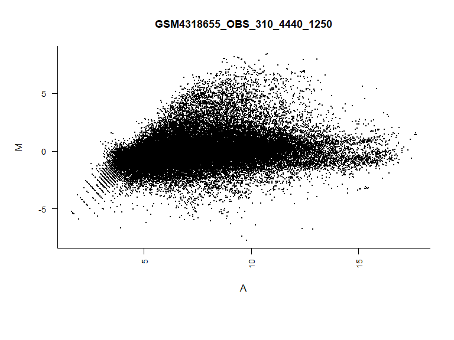
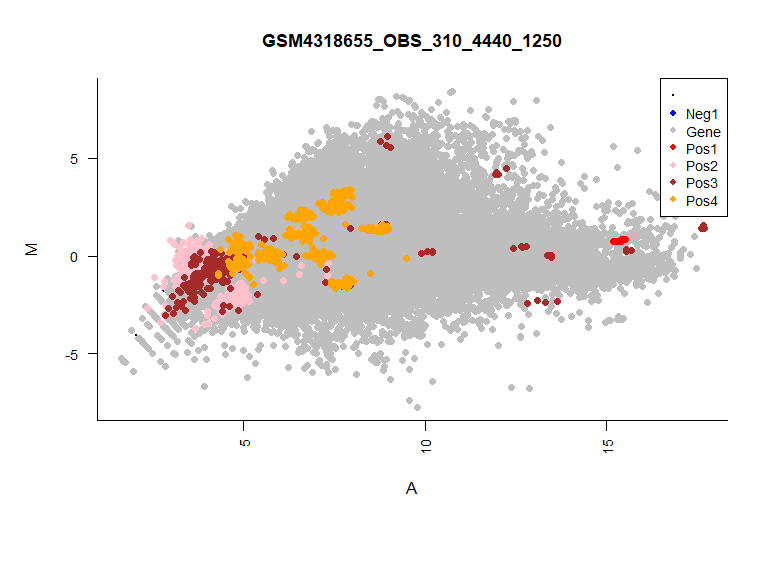
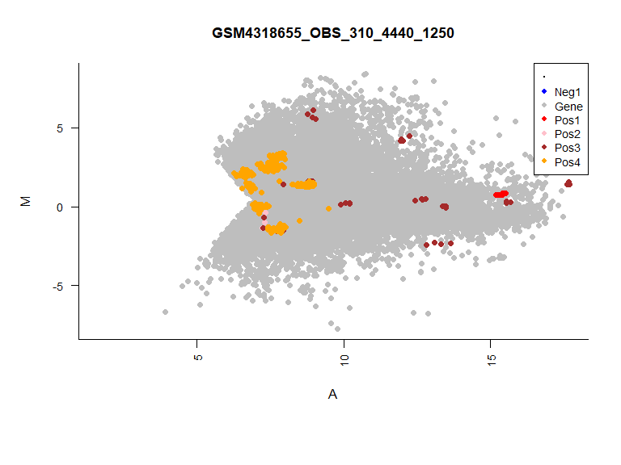
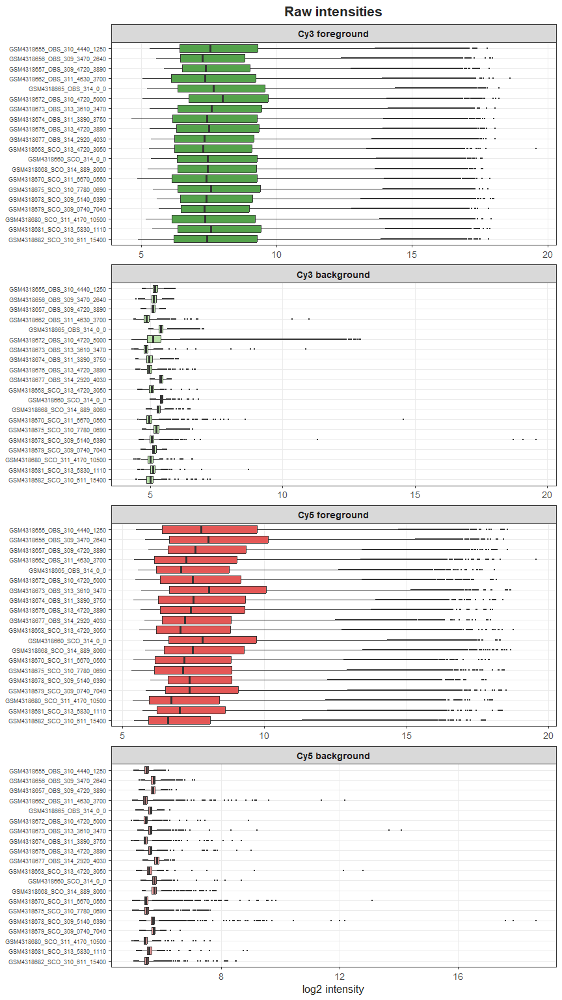
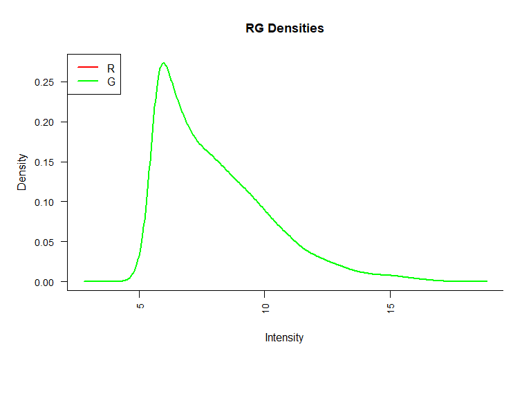
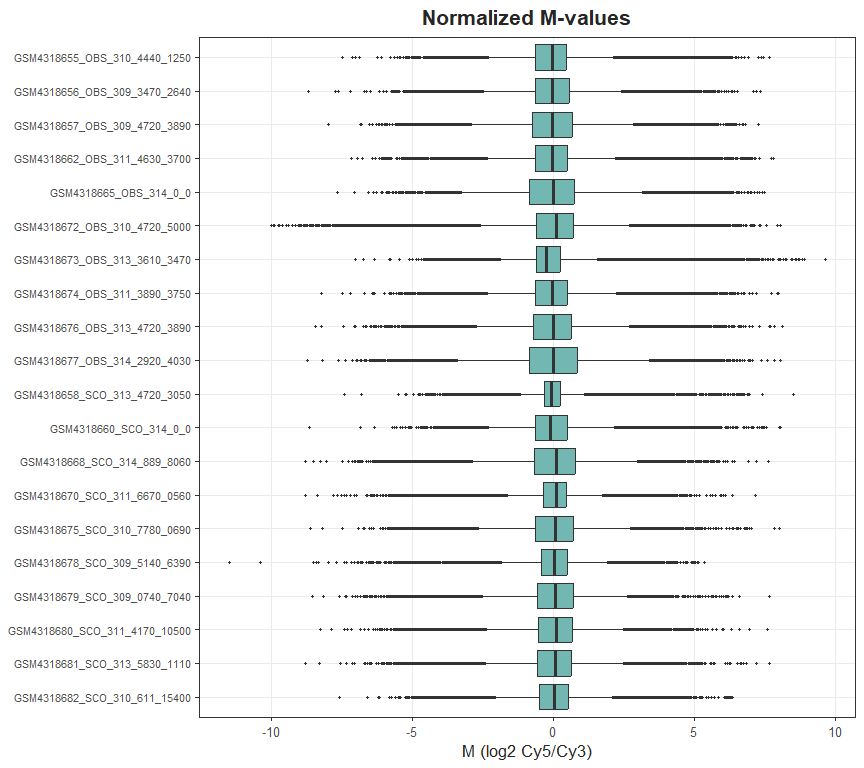
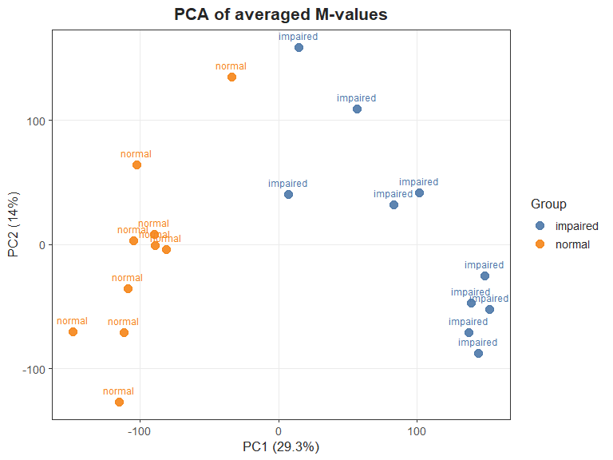

Two-color Agilent microarray analysis with limma
================
2026-09-19

- [Overview](#overview)
- [1. Packages](#1-packages)
- [2. Paths and phenotype](#2-paths-and-phenotype)
- [3. Read arrays](#3-read-arrays)
- [4. Spot filter and weighted
  import](#4-spot-filter-and-weighted-import)
- [5. Background correction and
  normalization](#5-background-correction-and-normalization)
- [6. Average replicate probes](#6-average-replicate-probes)
- [7. Linear model and contrast](#7-linear-model-and-contrast)
- [8. PCA](#8-pca)
- [Session info](#session-info)

# Overview

This notebook analyzes two-color Agilent arrays with
[limma](https://bioconductor.org/packages/limma/).

Expected files next to this notebook (or under the paths set below):

| File / folder    | Description                                   |
|------------------|-----------------------------------------------|
| `pheno.txt`      | limma targets file (`Cy5`, `Cy3`, file names) |
| `spot.txt`       | Spot-type file for control probes             |
| `GSE145467_RAW/` | Raw Agilent files listed in the targets file  |

Change `data_dir` if your files live somewhere else.

# 1. Packages

``` r
if (!requireNamespace("BiocManager", quietly = TRUE)) {
  install.packages("BiocManager")
}
BiocManager::install("limma")
install.packages("ggplot2")
```

``` r
library(limma)
library(ggplot2)

theme_set(
  theme_bw(base_size = 13, base_family = "Arial") +
    theme(
      text = element_text(family = "Arial", color = "grey15"),
      plot.title = element_text(face = "bold", hjust = 0.5),
      panel.grid.minor = element_blank()
    )
)

set_base_plot <- function() {
  par(
    family = "Arial",
    las = 2,
    cex.main = 1.1,
    cex.lab = 1,
    cex.axis = 0.85,
    bty = "l",
    mar = c(8, 5, 4, 2) + 0.1
  )
}

group_palette <- c("#4C78A8", "#F58518", "#54A24B", "#E45756", "#72B7B2", "#B279A2")
```

# 2. Paths and phenotype

``` r
# Original analysis folder (change if needed)
data_dir <- "C:/Users/Z/Desktop/Microarray_NOA"

if (dir.exists(data_dir)) {
  setwd(data_dir)
}

targets_file <- "pheno.txt"
spot_file    <- "spot.txt"
raw_dir      <- "GSE145467_RAW"

cat("Working directory:\n", getwd(), "\n\n")
```

    ## Working directory:
    ##  C:/Users/Z/Desktop/Microarray_NOA

``` r
print(list.files())
```

    ## [1] "Agilent_GSE145467_limma.Rmd" "GSE145467_RAW"              
    ## [3] "pheno.txt"                   "spot.txt"

``` r
if (!file.exists(targets_file)) {
  stop("Cannot find ", targets_file, " in ", getwd())
}
if (!file.exists(spot_file)) {
  stop("Cannot find ", spot_file, " in ", getwd())
}
if (!dir.exists(raw_dir)) {
  stop("Cannot find folder ", raw_dir, " in ", getwd())
}
```

``` r
phenodata <- readTargets(targets_file)

# Clean Cy3 / Cy5 labels (encoding and non-alphanumeric characters)
phenodata$Cy5 <- iconv(phenodata$Cy5, to = "UTF-8", sub = "")
phenodata$Cy3 <- iconv(phenodata$Cy3, to = "UTF-8", sub = "")
phenodata$Cy5 <- gsub("[^a-zA-Z0-9]", "", phenodata$Cy5)
phenodata$Cy3 <- gsub("[^a-zA-Z0-9]", "", phenodata$Cy3)

head(phenodata)
```

    ##                              SampleNumber                         FileName
    ## GSM4318655_OBS_310_4440_1250            1 GSM4318655_OBS_310_4440_1250.txt
    ## GSM4318656_OBS_309_3470_2640            2 GSM4318656_OBS_309_3470_2640.txt
    ## GSM4318657_OBS_309_4720_3890            3 GSM4318657_OBS_309_4720_3890.txt
    ## GSM4318662_OBS_311_4630_3700            4 GSM4318662_OBS_311_4630_3700.txt
    ## GSM4318665_OBS_314_0_0                  5       GSM4318665_OBS_314_0_0.txt
    ## GSM4318672_OBS_310_4720_5000            6 GSM4318672_OBS_310_4720_5000.txt
    ##                                 Cy5     Cy3
    ## GSM4318655_OBS_310_4440_1250 normal Control
    ## GSM4318656_OBS_309_3470_2640 normal Control
    ## GSM4318657_OBS_309_4720_3890 normal Control
    ## GSM4318662_OBS_311_4630_3700 normal Control
    ## GSM4318665_OBS_314_0_0       normal Control
    ## GSM4318672_OBS_310_4720_5000 normal Control

# 3. Read arrays

``` r
data <- read.maimages(
  files = phenodata,
  source = "agilent",
  path = raw_dir,
  green.only = FALSE
)
```

    ## Read GSE145467_RAW/GSM4318655_OBS_310_4440_1250.txt 
    ## Read GSE145467_RAW/GSM4318656_OBS_309_3470_2640.txt 
    ## Read GSE145467_RAW/GSM4318657_OBS_309_4720_3890.txt 
    ## Read GSE145467_RAW/GSM4318662_OBS_311_4630_3700.txt 
    ## Read GSE145467_RAW/GSM4318665_OBS_314_0_0.txt 
    ## Read GSE145467_RAW/GSM4318672_OBS_310_4720_5000.txt 
    ## Read GSE145467_RAW/GSM4318673_OBS_313_3610_3470.txt 
    ## Read GSE145467_RAW/GSM4318674_OBS_311_3890_3750.txt 
    ## Read GSE145467_RAW/GSM4318676_OBS_313_4720_3890.txt 
    ## Read GSE145467_RAW/GSM4318677_OBS_314_2920_4030.txt 
    ## Read GSE145467_RAW/GSM4318658_SCO_313_4720_3050.txt 
    ## Read GSE145467_RAW/GSM4318660_SCO_314_0_0.txt 
    ## Read GSE145467_RAW/GSM4318668_SCO_314_889_8060.txt 
    ## Read GSE145467_RAW/GSM4318670_SCO_311_6670_0560.txt 
    ## Read GSE145467_RAW/GSM4318675_SCO_310_7780_0690.txt 
    ## Read GSE145467_RAW/GSM4318678_SCO_309_5140_6390.txt 
    ## Read GSE145467_RAW/GSM4318679_SCO_309_0740_7040.txt 
    ## Read GSE145467_RAW/GSM4318680_SCO_311_4170_10500.txt 
    ## Read GSE145467_RAW/GSM4318681_SCO_313_5830_1110.txt 
    ## Read GSE145467_RAW/GSM4318682_SCO_310_611_15400.txt

``` r
set_base_plot()
plotMD(data)
```

<figure>

<figcaption aria-hidden="true">MA plot of raw arrays</figcaption>
</figure>

``` r
spot <- readSpotTypes(file = spot_file)
data$genes$Status <- controlStatus(types = spot, genes = data)
```

    ## Matching patterns for: ProbeName 
    ## Found 153 Neg1 
    ## Found 43376 Gene 
    ## Found 14 Pos1 
    ## Found 604 Pos2 
    ## Found 222 Pos3 
    ## Found 320 Pos4 
    ## Setting attributes: values Color

``` r
set_base_plot()
plotMD(data)
```

<!-- -->

# 4. Spot filter and weighted import

Keep a spot if the foreground / background ratio is \> 4.5 in Cy5 or
Cy3.

``` r
filter <- function(x) {
  R <- x[, "rMedianSignal"] / x[, "rBGMedianSignal"] > 4.5
  G <- x[, "gMedianSignal"] / x[, "gBGMedianSignal"] > 4.5
  as.numeric(R | G)
}
```

``` r
data2 <- read.maimages(
  files = phenodata,
  source = "agilent",
  path = raw_dir,
  green.only = FALSE,
  wt.fun = filter
)
```

    ## Read GSE145467_RAW/GSM4318655_OBS_310_4440_1250.txt 
    ## Read GSE145467_RAW/GSM4318656_OBS_309_3470_2640.txt 
    ## Read GSE145467_RAW/GSM4318657_OBS_309_4720_3890.txt 
    ## Read GSE145467_RAW/GSM4318662_OBS_311_4630_3700.txt 
    ## Read GSE145467_RAW/GSM4318665_OBS_314_0_0.txt 
    ## Read GSE145467_RAW/GSM4318672_OBS_310_4720_5000.txt 
    ## Read GSE145467_RAW/GSM4318673_OBS_313_3610_3470.txt 
    ## Read GSE145467_RAW/GSM4318674_OBS_311_3890_3750.txt 
    ## Read GSE145467_RAW/GSM4318676_OBS_313_4720_3890.txt 
    ## Read GSE145467_RAW/GSM4318677_OBS_314_2920_4030.txt 
    ## Read GSE145467_RAW/GSM4318658_SCO_313_4720_3050.txt 
    ## Read GSE145467_RAW/GSM4318660_SCO_314_0_0.txt 
    ## Read GSE145467_RAW/GSM4318668_SCO_314_889_8060.txt 
    ## Read GSE145467_RAW/GSM4318670_SCO_311_6670_0560.txt 
    ## Read GSE145467_RAW/GSM4318675_SCO_310_7780_0690.txt 
    ## Read GSE145467_RAW/GSM4318678_SCO_309_5140_6390.txt 
    ## Read GSE145467_RAW/GSM4318679_SCO_309_0740_7040.txt 
    ## Read GSE145467_RAW/GSM4318680_SCO_311_4170_10500.txt 
    ## Read GSE145467_RAW/GSM4318681_SCO_313_5830_1110.txt 
    ## Read GSE145467_RAW/GSM4318682_SCO_310_611_15400.txt

``` r
data2$genes$Status <- controlStatus(types = spot, genes = data2)
```

    ## Matching patterns for: ProbeName 
    ## Found 153 Neg1 
    ## Found 43376 Gene 
    ## Found 14 Pos1 
    ## Found 604 Pos2 
    ## Found 222 Pos3 
    ## Found 320 Pos4 
    ## Setting attributes: values Color

``` r
set_base_plot()
plotMD(data2)
```

<figure>

<figcaption aria-hidden="true">MA plot after spot weighting</figcaption>
</figure>

``` r
stack_log <- function(mat, panel) {
  df <- stack(as.data.frame(log2(mat)))
  colnames(df) <- c("intensity", "sample")
  df$panel <- panel
  df
}

raw_long <- rbind(
  stack_log(data2$G, "Cy3 foreground"),
  stack_log(data2$Gb, "Cy3 background"),
  stack_log(data2$R, "Cy5 foreground"),
  stack_log(data2$Rb, "Cy5 background")
)

raw_long$panel <- factor(
  raw_long$panel,
  levels = c("Cy3 foreground", "Cy3 background", "Cy5 foreground", "Cy5 background")
)
raw_long$sample <- factor(raw_long$sample, levels = rev(colnames(data2$G)))

fill_cols <- c(
  "Cy3 foreground" = "#54A24B",
  "Cy3 background" = "#B8E0A8",
  "Cy5 foreground" = "#E45756",
  "Cy5 background" = "#F4A3A3"
)

ggplot(raw_long, aes(x = sample, y = intensity, fill = panel)) +
  geom_boxplot(color = "grey20", outlier.size = 0.4, show.legend = FALSE) +
  scale_fill_manual(values = fill_cols) +
  coord_flip() +
  facet_wrap(~ panel, ncol = 1, scales = "free_x") +
  labs(title = "Raw intensities", x = NULL, y = "log2 intensity") +
  theme(
    axis.text.y = element_text(family = "Arial", size = 7),
    strip.text = element_text(family = "Arial", face = "bold")
  )
```

<figure>

<figcaption aria-hidden="true">Raw foreground and background
intensities</figcaption>
</figure>

# 5. Background correction and normalization

``` r
background_corrected <- backgroundCorrect(
  RG = data2,
  method = "normexp",
  offset = 15
)
```

    ## Array 1 corrected
    ## Array 2 corrected
    ## Array 3 corrected
    ## Array 4 corrected
    ## Array 5 corrected
    ## Array 6 corrected
    ## Array 7 corrected
    ## Array 8 corrected
    ## Array 9 corrected
    ## Array 10 corrected
    ## Array 11 corrected
    ## Array 12 corrected
    ## Array 13 corrected
    ## Array 14 corrected
    ## Array 15 corrected
    ## Array 16 corrected
    ## Array 17 corrected
    ## Array 18 corrected
    ## Array 19 corrected
    ## Array 20 corrected
    ## Array 1 corrected
    ## Array 2 corrected
    ## Array 3 corrected
    ## Array 4 corrected
    ## Array 5 corrected
    ## Array 6 corrected
    ## Array 7 corrected
    ## Array 8 corrected
    ## Array 9 corrected
    ## Array 10 corrected
    ## Array 11 corrected
    ## Array 12 corrected
    ## Array 13 corrected
    ## Array 14 corrected
    ## Array 15 corrected
    ## Array 16 corrected
    ## Array 17 corrected
    ## Array 18 corrected
    ## Array 19 corrected
    ## Array 20 corrected

``` r
MA <- normalizeWithinArrays(background_corrected, method = "loess")
norm_data <- normalizeBetweenArrays(object = MA, method = "quantile")
```

``` r
set_base_plot()
plotDensities(norm_data)
```

<figure>

<figcaption aria-hidden="true">Densities after
normalization</figcaption>
</figure>

``` r
M_long <- stack(as.data.frame(norm_data$M))
colnames(M_long) <- c("M", "sample")
M_long$sample <- factor(M_long$sample, levels = rev(colnames(norm_data$M)))

ggplot(M_long, aes(x = sample, y = M)) +
  geom_boxplot(fill = "#72B7B2", color = "grey20", outlier.size = 0.6) +
  coord_flip() +
  labs(
    title = "Normalized M-values",
    x = NULL,
    y = "M (log2 Cy5/Cy3)"
  ) +
  theme(
    axis.text.y = element_text(family = "Arial", size = 8),
    axis.text.x = element_text(family = "Arial", size = 10)
  )
```

<figure>

<figcaption aria-hidden="true">Normalized M-values</figcaption>
</figure>

# 6. Average replicate probes

``` r
ave <- avereps(x = norm_data, ID = norm_data$genes$ProbeName)
```

# 7. Linear model and contrast

Reference group in the targets file: `Control`.  
The contrast of interest is `impaired - normal`.

``` r
design <- modelMatrix(targets = phenodata, ref = "Control")
```

    ## Found unique target names:
    ##  Control impaired normal

``` r
fit <- lmFit(object = ave, design = design)

contrast <- makeContrasts(
  contrasts = c("impaired", "normal", "impaired-normal"),
  levels = design
)

fit2 <- contrasts.fit(fit = fit, contrasts = contrast)
fit3 <- eBayes(fit2)
```

``` r
tt <- topTable(
  fit = fit3,
  number = Inf,
  adjust.method = "fdr",
  coef = "impaired-normal",
  sort.by = "logFC"
)

sig <- subset(tt, adj.P.Val < 0.05)
write.table(sig, "DEG_impaired_vs_normal.txt", quote = FALSE, sep = "\t")

up <- subset(sig, logFC > 1)
up <- subset(up, select = intersect(c("GeneName", "adj.P.Val", "logFC"), colnames(up)))
write.table(up, "DEG_up_logFC_gt1.txt", quote = FALSE, sep = "\t")

head(sig)
```

    ##              Row Col Start
    ## A_32_P6628   456  33   290
    ## A_23_P30900  403  46   960
    ## A_23_P335958 421  40  2991
    ## A_24_P347378 459  34   495
    ## A_32_P184464  95  17   940
    ## A_32_P204753 374  54   101
    ##                                                                  Sequence
    ## A_32_P6628   CTGGATGAGATTCCTGATTTCCATAATCTGTACCTGGAGGTTTATACAGGAGAGGATCAC
    ## A_23_P30900  ACTTAAATTGCTATATCTGCTCAGAGCTCACAAATGCCTTTGAATTATTTCCCTGACTTC
    ## A_23_P335958 CCCTAAGACCTAAATTATGCAGGGGAGAACCCTACATGGAATCATATTCTAGCCGCGTAT
    ## A_24_P347378 ATTACCTCATCTTCTTTTTCGGAAGTGACTTTGAAAACTACATAAAGACGATCTCCACCA
    ## A_32_P184464 GAATGACTTTACCCAAAACCCCAGGGTTCAGCTGGAGTAAAAGCACAATTTTGGCAATTT
    ## A_32_P204753 ACAGATGGGGGATTTGAGGATTAGGCTTGCTACTGAGTCTTTAATATGATTTCTGTTACA
    ##              ProbeUID ControlType    ProbeName        GeneName  SystematicName
    ## A_32_P6628      35373           0   A_32_P6628 ENST00000436551 ENST00000436551
    ## A_23_P30900     31352           0  A_23_P30900 ENST00000552745 ENST00000552745
    ## A_23_P335958    32742           0 A_23_P335958          GPR155    NM_001033045
    ## A_24_P347378    35688           0 A_24_P347378         ALOX5AP       NM_001629
    ## A_32_P184464     7325           0 A_32_P184464           ROPN1       NM_017578
    ## A_32_P204753    29043           0 A_32_P204753          T66139          T66139
    ##                                                                                                                    Description
    ## A_32_P6628                                                                                                             Unknown
    ## A_23_P30900                                 ens|Uncharacterized protein [Source:UniProtKB/TrEMBL;Acc:E7ET45] [ENST00000552745]
    ## A_23_P335958               ref|Homo sapiens G protein-coupled receptor 155 (GPR155), transcript variant 9, mRNA [NM_001033045]
    ## A_24_P347378 ref|Homo sapiens arachidonate 5-lipoxygenase-activating protein (ALOX5AP), transcript variant 1, mRNA [NM_001629]
    ## A_32_P184464                                    ref|Homo sapiens rhophilin associated tail protein 1 (ROPN1), mRNA [NM_017578]
    ## A_32_P204753             gb|yc77b03.s1 Soares infant brain 1NIB Homo sapiens cDNA clone IMAGE:21948 3', mRNA sequence [T66139]
    ##              Status     logFC   AveExpr         t      P.Value    adj.P.Val
    ## A_32_P6628     Gene  9.332182  6.999411 22.957891 1.210491e-06 1.768688e-05
    ## A_23_P30900    Gene  9.169566  6.496314 15.579915 2.496358e-04 1.212211e-03
    ## A_23_P335958   Gene  8.287299  7.198662 13.698716 5.140657e-06 5.653203e-05
    ## A_24_P347378   Gene  7.922987  6.862438 13.461867 4.112406e-04 1.810960e-03
    ## A_32_P184464   Gene -7.631480 10.132657 -9.908553 1.829619e-09 9.188735e-08
    ## A_32_P204753   Gene  7.185640  6.275302 12.209047 5.734515e-04 2.366848e-03
    ##                        B
    ## A_32_P6628    3.76582040
    ## A_23_P30900   0.02952424
    ## A_23_P335958  3.89796367
    ## A_24_P347378 -0.11869389
    ## A_32_P184464 11.81684566
    ## A_32_P204753 -0.23654970

``` r
nrow(sig)
```

    ## [1] 12840

``` r
nrow(up)
```

    ## [1] 2765

# 8. PCA

``` r
samp_groups <- factor(phenodata$Cy5)
samp_cols <- group_palette[seq_along(levels(samp_groups))]
names(samp_cols) <- levels(samp_groups)
```

``` r
M <- ave$M
keep <- complete.cases(M)
pca <- prcomp(t(M[keep, , drop = FALSE]), scale. = TRUE)
pct <- 100 * pca$sdev^2 / sum(pca$sdev^2)

pca_df <- data.frame(
  PC1 = pca$x[, 1],
  PC2 = pca$x[, 2],
  group = samp_groups[match(rownames(pca$x), colnames(M))]
)

ggplot(pca_df, aes(x = PC1, y = PC2, color = group)) +
  geom_point(size = 3.5, alpha = 0.9) +
  geom_text(aes(label = group), family = "Arial", size = 3.2, vjust = -1, show.legend = FALSE) +
  scale_color_manual(values = samp_cols) +
  labs(
    title = "PCA of averaged M-values",
    x = paste0("PC1 (", round(pct[1], 1), "%)"),
    y = paste0("PC2 (", round(pct[2], 1), "%)"),
    color = "Group"
  )
```

<figure>

<figcaption aria-hidden="true">PCA of averaged M-values</figcaption>
</figure>

# Session info

``` r
sessionInfo()
```

    ## R version 4.5.0 (2025-04-11 ucrt)
    ## Platform: x86_64-w64-mingw32/x64
    ## Running under: Windows 11 x64 (build 26100)
    ## 
    ## Matrix products: default
    ##   LAPACK version 3.12.1
    ## 
    ## locale:
    ## [1] LC_COLLATE=English_United States.utf8 
    ## [2] LC_CTYPE=English_United States.utf8   
    ## [3] LC_MONETARY=English_United States.utf8
    ## [4] LC_NUMERIC=C                          
    ## [5] LC_TIME=English_United States.utf8    
    ## 
    ## time zone: Europe/Berlin
    ## tzcode source: internal
    ## 
    ## attached base packages:
    ## [1] stats     graphics  grDevices utils     datasets  methods   base     
    ## 
    ## other attached packages:
    ## [1] ggplot2_4.0.3 limma_3.66.0 
    ## 
    ## loaded via a namespace (and not attached):
    ##  [1] vctrs_0.7.3        cli_3.6.6          knitr_1.51         rlang_1.3.0       
    ##  [5] xfun_0.60          otel_0.2.0         generics_0.1.4     S7_0.2.2          
    ##  [9] labeling_0.4.3     glue_1.8.1         statmod_1.5.2      htmltools_0.5.9   
    ## [13] scales_1.4.0       rmarkdown_2.31     grid_4.5.0         tibble_3.3.1      
    ## [17] evaluate_1.0.5     fastmap_1.2.0      yaml_2.3.12        lifecycle_1.0.5   
    ## [21] compiler_4.5.0     dplyr_1.2.1        RColorBrewer_1.1-3 pkgconfig_2.0.3   
    ## [25] rstudioapi_0.19.0  farver_2.1.2       digest_0.6.39      R6_2.6.1          
    ## [29] tidyselect_1.2.1   pillar_1.11.1      magrittr_2.0.5     withr_3.0.3       
    ## [33] tools_4.5.0        gtable_0.3.6
