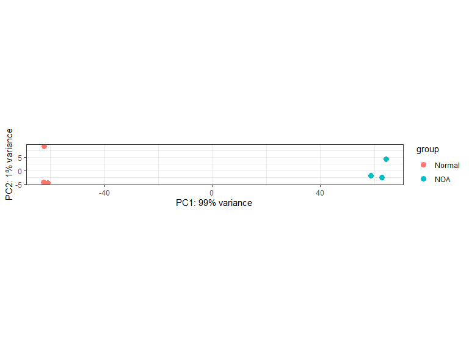
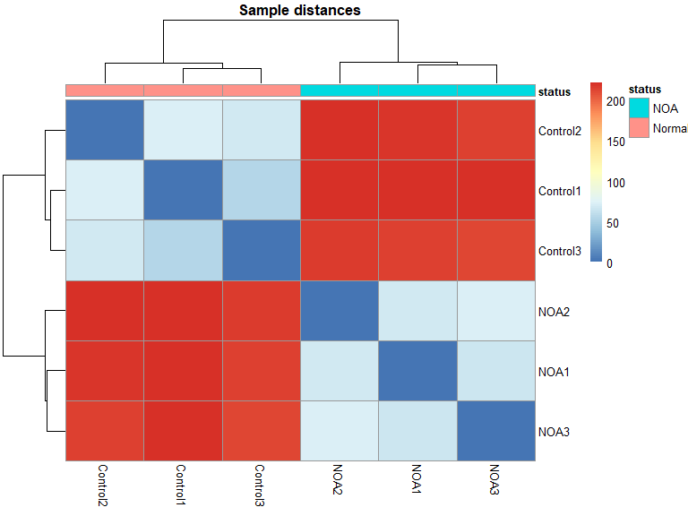
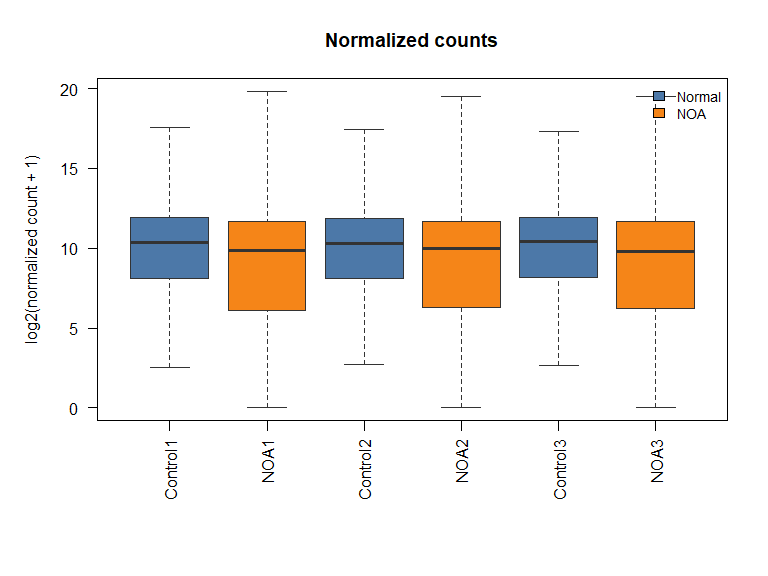
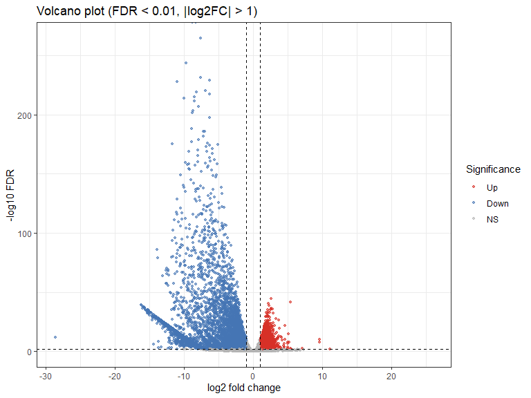

Differential Expression Analysis with DESeq2
================
Seyedeh Zahra Mousavi
2026-09-19

- [Overview](#overview)
- [1. Install and load packages](#1-install-and-load-packages)
- [2. Working directory and input
  data](#2-working-directory-and-input-data)
  - [Count matrix](#count-matrix)
  - [Filter lowly expressed genes](#filter-lowly-expressed-genes)
  - [Phenotype / sample information](#phenotype--sample-information)
  - [Align sample order](#align-sample-order)
- [3. Build the DESeq2 object](#3-build-the-deseq2-object)
- [4. Run DESeq2](#4-run-deseq2)
- [5. Results](#5-results)
  - [Export](#export)
- [6. Plots](#6-plots)
  - [PCA](#pca)
  - [Sample heatmap](#sample-heatmap)
  - [Boxplot after normalization](#boxplot-after-normalization)
  - [Volcano plot](#volcano-plot)
- [Session info](#session-info)

# Overview

This notebook performs differential expression analysis on bulk RNA-seq
count data using [DESeq2](https://bioconductor.org/packages/DESeq2/).

**Expected input files (same folder as this `.Rmd`):**

| File         | Description                                           |
|--------------|-------------------------------------------------------|
| `counts.txt` | Gene count matrix (genes as rows, samples as columns) |
| `Pheno.txt`  | Sample metadata / phenotype table (samples as rows)   |

> **Note:** Change the working directory and file names if your paths
> differ. The original script used a Windows path (`C:/Users/...`). For
> GitHub and reproducibility, keep the data files next to the notebook
> or use a relative path.

------------------------------------------------------------------------

# 1. Install and load packages

Run the installation block **once**. After that, only load the
libraries.

``` r
if (!requireNamespace("BiocManager", quietly = TRUE)) {
  install.packages("BiocManager")
}
BiocManager::install("DESeq2")
install.packages(c("ggplot2", "pheatmap"))
```

``` r
library(DESeq2)
library(ggplot2)
library(pheatmap)

theme_set(
  theme_bw(base_family = "Arial") +
    theme(text = element_text(family = "Arial"))
)
```

------------------------------------------------------------------------

# 2. Working directory and input data

``` r
# Folder that contains count.txt and Pheno.txt
data_dir <- "C:/Users/Z/Desktop/GSE190752/"
if (dir.exists(data_dir)) {
  setwd(data_dir)
}

count_file <- "counts.txt"
pheno_file <- "Pheno.txt"

cat("Working directory:\n", getwd(), "\n\n")
```

    ## Working directory:
    ##  C:/Users/Z/Desktop/GSE190752

``` r
cat("Files in this folder:\n")
```

    ## Files in this folder:

``` r
print(list.files())
```

    ## [1] "counts.txt"                    "DESeq2_GSE190752_analysis.Rmd"
    ## [3] "Pheno.txt"

``` r
if (!file.exists(count_file)) {
  stop("Cannot find ", count_file, " in ", getwd(),
       ". Put the count file in this folder or change count_file / data_dir.")
}
if (!file.exists(pheno_file)) {
  stop("Cannot find ", pheno_file, " in ", getwd(),
       ". Put the phenotype file in this folder or change pheno_file / data_dir.")
}
```

## Count matrix

``` r
Counts <- read.delim(count_file, sep = "\t", row.names = 1)
colnames(Counts)
```

    ## [1] "Control1" "NOA1"     "Control2" "NOA2"     "Control3" "NOA3"

``` r
dim(Counts)
```

    ## [1] 19447     6

## Filter lowly expressed genes

Keep genes with a total count of at least 10 across all samples.

``` r
keep <- rowSums(Counts) >= 10
Counts <- Counts[keep, ]
dim(Counts)
```

    ## [1] 18598     6

## Phenotype / sample information

``` r
info <- read.delim(pheno_file, header = TRUE, row.names = 1)
rownames(info)
```

    ## [1] "Control1" "NOA1"     "Control2" "NOA2"     "Control3" "NOA3"

``` r
colnames(info)
```

    ## [1] "status"

## Align sample order

DESeq2 requires that columns of the count matrix match the rows of
`colData`.

``` r
stopifnot(all(rownames(info) %in% colnames(Counts)))
Counts_Ordered <- Counts[, rownames(info)]
identical(colnames(Counts_Ordered), rownames(info))
```

    ## [1] TRUE

------------------------------------------------------------------------

# 3. Build the DESeq2 object

The design formula uses the `status` column in the phenotype table.  
Change `~ status` if your grouping variable has another name.

``` r
dds <- DESeqDataSetFromMatrix(
  countData = Counts_Ordered,
  colData   = info,
  design    = ~ status
)
dds
```

    ## class: DESeqDataSet 
    ## dim: 18598 6 
    ## metadata(1): version
    ## assays(1): counts
    ## rownames(18598): RNF14 HIF3A ... NFIX SELP
    ## rowData names(0):
    ## colnames(6): Control1 NOA1 ... Control3 NOA3
    ## colData names(1): status

Set the reference level for the contrast (here: `"Normal"`).

``` r
# Column in colData is "status" (from the design formula).
# The original script assigned to dds$condition; we keep status consistent.
dds$status <- relevel(factor(dds$status), ref = "Normal")
```

------------------------------------------------------------------------

# 4. Run DESeq2

``` r
dds <- DESeq(dds)
```

------------------------------------------------------------------------

# 5. Results

``` r
res <- results(dds)
res
```

    ## log2 fold change (MLE): status NOA vs Normal 
    ## Wald test p-value: status NOA vs Normal 
    ## DataFrame with 18598 rows and 6 columns
    ##           baseMean log2FoldChange     lfcSE      stat      pvalue        padj
    ##          <numeric>      <numeric> <numeric> <numeric>   <numeric>   <numeric>
    ## RNF14     7302.322     -0.1152624  0.171395 -0.672496 5.01268e-01 5.71496e-01
    ## HIF3A      986.904      1.5137574  0.452446  3.345722 8.20687e-04 1.72268e-03
    ## RNF17     2310.223     -8.4545260  1.228688 -6.880939 5.94594e-12 3.29781e-11
    ## RNF10    16193.182     -0.7906593  0.180311 -4.384980 1.15996e-05 3.17959e-05
    ## RNF11     6346.352     -0.0395913  0.245719 -0.161124 8.71996e-01 8.97818e-01
    ## ...            ...            ...       ...       ...         ...         ...
    ## GNGT2      22.6713      -0.647589  0.958979  -0.67529 4.99491e-01 5.69822e-01
    ## NPAP1L    576.6927     -12.534678  1.239045 -10.11640 4.67291e-24 5.87193e-23
    ## SERPINH1 8851.9600       1.553359  0.178414   8.70647 3.13497e-18 2.81630e-17
    ## NFIX     3215.7685       0.780099  0.294991   2.64448 8.18159e-03 1.45935e-02
    ## SELP       57.4068      -0.960579  0.850350  -1.12963 2.58633e-01 3.24071e-01

``` r
summary(res)
```

    ## 
    ## out of 18598 with nonzero total read count
    ## adjusted p-value < 0.1
    ## LFC > 0 (up)       : 5200, 28%
    ## LFC < 0 (down)     : 7298, 39%
    ## outliers [1]       : 101, 0.54%
    ## low counts [2]     : 0, 0%
    ## (mean count < 1)
    ## [1] see 'cooksCutoff' argument of ?results
    ## [2] see 'independentFiltering' argument of ?results

## Export

``` r
write.csv(as.data.frame(res), "RES_DESEQ2_Comparison2.csv")
```

------------------------------------------------------------------------

# 6. Plots

``` r
vsd <- vst(dds, blind = FALSE)
```

## PCA

``` r
plotPCA(vsd, intgroup = "status") +
  theme_bw(base_family = "Arial") +
  theme(text = element_text(family = "Arial"))
```

<figure>

<figcaption aria-hidden="true">PCA of VST-transformed
counts</figcaption>
</figure>

## Sample heatmap

``` r
sample_dists <- dist(t(assay(vsd)))
sample_dist_matrix <- as.matrix(sample_dists)
pheatmap(
  sample_dist_matrix,
  clustering_distance_rows = sample_dists,
  clustering_distance_cols = sample_dists,
  annotation_col = info["status"],
  main = "Sample distances",
  fontsize = 10,
  fontfamily = "Arial"
)
```

<figure>

<figcaption aria-hidden="true">Sample-to-sample distance
heatmap</figcaption>
</figure>

## Boxplot after normalization

``` r
norm_counts <- counts(dds, normalized = TRUE)
status_levels <- unique(as.character(info[colnames(norm_counts), "status"]))
status_colors <- setNames(
  c("#4C78A8", "#F58518", "#54A24B", "#E45756", "#72B7B2")[seq_along(status_levels)],
  status_levels
)
box_cols <- status_colors[as.character(info[colnames(norm_counts), "status"])]

par(family = "Arial", mar = c(8, 5, 4, 2) + 0.1)
boxplot(
  log2(norm_counts + 1),
  las = 2,
  outline = FALSE,
  col = box_cols,
  border = "grey20",
  main = "Normalized counts",
  ylab = "log2(normalized count + 1)",
  xlab = ""
)
legend(
  "topright",
  legend = names(status_colors),
  fill = status_colors,
  bty = "n",
  cex = 0.9
)
```

<figure>

<figcaption aria-hidden="true">Normalized counts per sample</figcaption>
</figure>

## Volcano plot

DEGs: FDR \< 0.01 and \|log2 fold change\| \> 1.

``` r
res_df <- as.data.frame(res)
res_df$gene <- rownames(res_df)

padj_cutoff <- 0.01
lfc_cutoff  <- 1

res_df$sig <- "NS"
res_df$sig[!is.na(res_df$padj) & res_df$padj < padj_cutoff & res_df$log2FoldChange >  lfc_cutoff] <- "Up"
res_df$sig[!is.na(res_df$padj) & res_df$padj < padj_cutoff & res_df$log2FoldChange < -lfc_cutoff] <- "Down"
res_df$sig <- factor(res_df$sig, levels = c("Up", "Down", "NS"))

ggplot(res_df, aes(x = log2FoldChange, y = -log10(padj), color = sig)) +
  geom_point(alpha = 0.6, size = 1.2, na.rm = TRUE) +
  scale_color_manual(values = c(Up = "#D73027", Down = "#4575B4", NS = "grey70")) +
  geom_vline(xintercept = c(-lfc_cutoff, lfc_cutoff), linetype = "dashed") +
  geom_hline(yintercept = -log10(padj_cutoff), linetype = "dashed") +
  theme_bw(base_family = "Arial") +
  theme(text = element_text(family = "Arial")) +
  labs(
    title = "Volcano plot (FDR < 0.01, |log2FC| > 1)",
    x = "log2 fold change",
    y = "-log10 FDR",
    color = "Significance"
  )
```

<figure>

<figcaption aria-hidden="true">Volcano plot</figcaption>
</figure>

------------------------------------------------------------------------

# Session info

``` r
sessionInfo()
```

    ## R version 4.5.0 (2025-04-11 ucrt)
    ## Platform: x86_64-w64-mingw32/x64
    ## Running under: Windows 11 x64 (build 26100)
    ## 
    ## Matrix products: default
    ##   LAPACK version 3.12.1
    ## 
    ## locale:
    ## [1] LC_COLLATE=English_United States.utf8 
    ## [2] LC_CTYPE=English_United States.utf8   
    ## [3] LC_MONETARY=English_United States.utf8
    ## [4] LC_NUMERIC=C                          
    ## [5] LC_TIME=English_United States.utf8    
    ## 
    ## time zone: Europe/Berlin
    ## tzcode source: internal
    ## 
    ## attached base packages:
    ## [1] stats4    stats     graphics  grDevices utils     datasets  methods  
    ## [8] base     
    ## 
    ## other attached packages:
    ##  [1] pheatmap_1.0.13             ggplot2_4.0.3              
    ##  [3] DESeq2_1.50.2               SummarizedExperiment_1.40.0
    ##  [5] Biobase_2.70.0              MatrixGenerics_1.22.0      
    ##  [7] matrixStats_1.5.0           GenomicRanges_1.62.1       
    ##  [9] Seqinfo_1.0.0               IRanges_2.44.0             
    ## [11] S4Vectors_0.48.1            BiocGenerics_0.56.0        
    ## [13] generics_0.1.4             
    ## 
    ## loaded via a namespace (and not attached):
    ##  [1] SparseArray_1.10.10 lattice_0.23-1      digest_0.6.39      
    ##  [4] magrittr_2.0.5      evaluate_1.0.5      grid_4.5.0         
    ##  [7] RColorBrewer_1.1-3  fastmap_1.2.0       Matrix_1.7-3       
    ## [10] scales_1.4.0        codetools_0.2-20    abind_1.4-8        
    ## [13] cli_3.6.6           rlang_1.3.0         XVector_0.50.0     
    ## [16] withr_3.0.3         DelayedArray_0.36.1 yaml_2.3.12        
    ## [19] otel_0.2.0          S4Arrays_1.10.1     tools_4.5.0        
    ## [22] parallel_4.5.0      BiocParallel_1.44.0 dplyr_1.2.1        
    ## [25] locfit_1.5-9.12     vctrs_0.7.3         R6_2.6.1           
    ## [28] lifecycle_1.0.5     pkgconfig_2.0.3     pillar_1.11.1      
    ## [31] gtable_0.3.6        glue_1.8.1          Rcpp_1.1.2         
    ## [34] xfun_0.60           tibble_3.3.1        tidyselect_1.2.1   
    ## [37] rstudioapi_0.19.0   knitr_1.51          farver_2.1.2       
    ## [40] htmltools_0.5.9     labeling_0.4.3      rmarkdown_2.31     
    ## [43] compiler_4.5.0      S7_0.2.2
